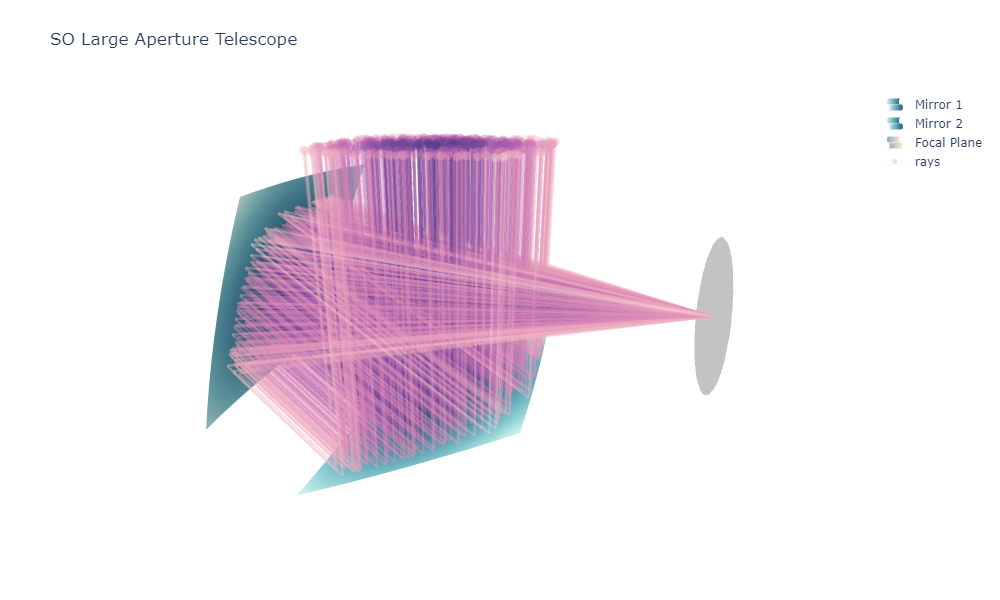

[](https://github.com/psf/black)
# lat_holocal 
This project is inherited from ```holosim-ml``` 📡 [https://github.com/McMahonCosmologyGroup/holosim-ml], which is a library for beam simulation and analysis of radio holography data from complex optical systems. We improve the computational performance and enhance the functionalites of the original ```holosim-ml```, and adapt the code for SO LAT holographic surface measurement. 


<p align="center">
     
</p>
⚠️This is an ongoing project, bugs and mistakes may appear everywhere.

## Dependencies
* Python>=3.6
* numpy, scipy, matplotlib, sklearn, ...

We suggest creating an new environment with conda and installing the required packages with pip

```
$ pip install -r requirements.txt
```
## Get started
Try the notebooks under the tutorial


## 
Email: ctcheung@uchicago.edu for any enquiry